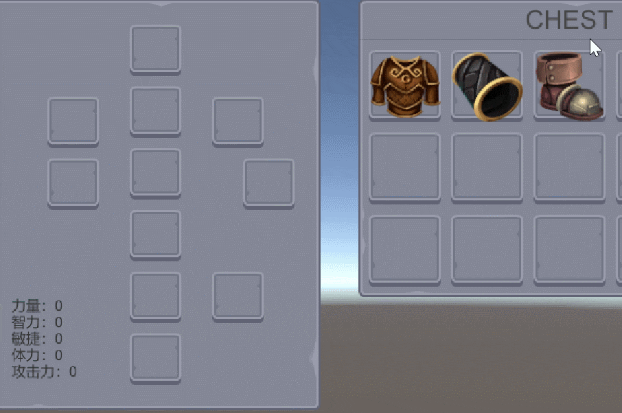
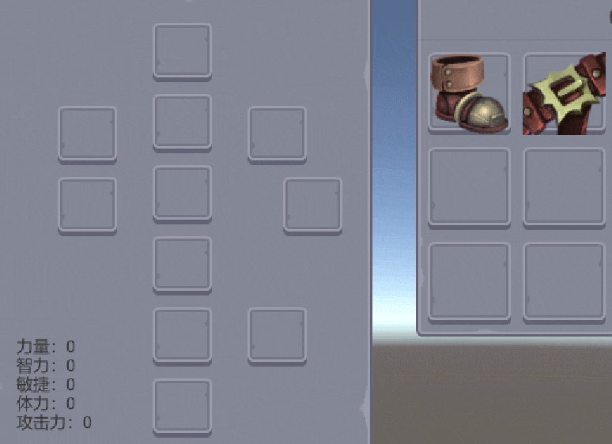
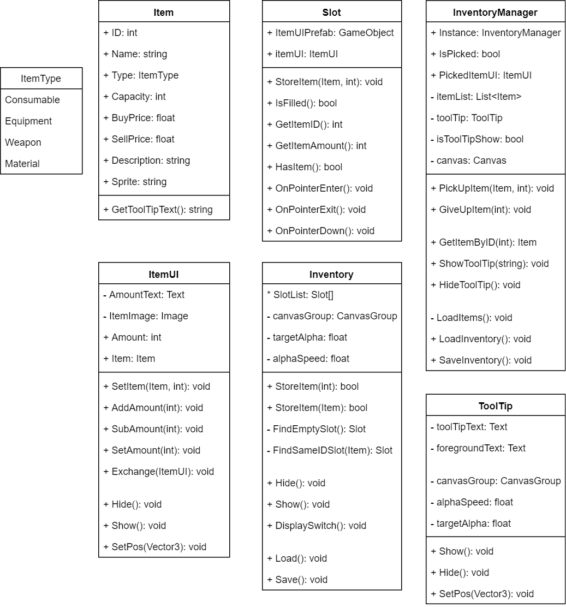
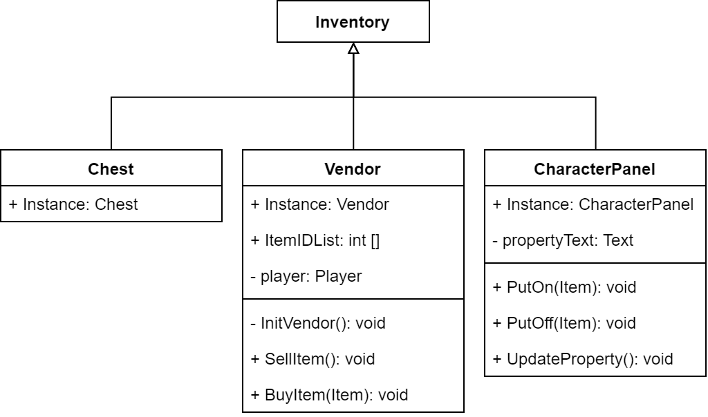
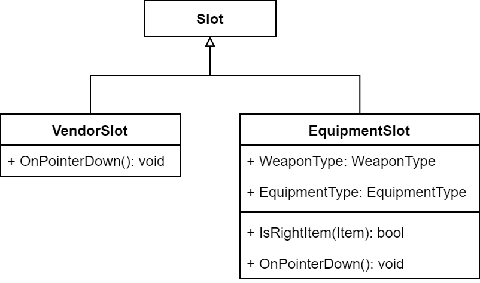

# Hello Inventory System

> Unity 实现的背包系统。

## TEST

1. 点击底部 **TEST** 按钮随机生成物品到 `Chest` ；
2. 点击物品可以将其**“拿起”**，按住键盘左侧的 <kbd>Ctrl</kbd> 键可以按**半数**拿起和放下；
3. 属于装备的物品可以点击**右键装备**上，显示在人物装备属性面板，相应地在人物装备面板**右键**可**卸下**装备；
4. 商店的物品点击**右键**可以**购买**（*钱足够的话*），左键点击商店的任一物品槽可**卖出**手上的物品，按住键盘左侧的 <kbd>Ctrl</kbd> 键可以**单个**出售；
5. *鼠标放在物品上有跟随鼠标的提示框显示其信息*。

## 实现

- `Item` 作为各种物品的**父类**，定义物品的各种属性，提供 `ToolTip` 的内容。

- `Inventory` 作为背包、箱子、商店等各种放置物品槽的 Panel 的**父类**，背包箱子都只需要实现单例，其他则需要实现特定行为如*购买物品* 、*出售物品* 等。背包与箱子的功能和实现都一致，所以只做了箱子（`Chest`）。

- `InventoryManager` 拥有单例，负责加载所有 `Item` ，也负责鼠标所 “**拿着**” 的物品和提示框（`ToolTip`）的显示。

- `Slot` *has* `ItemUI` *has* `Item` ，`Slot` 中进行**点击**与**hover**事件的处理。`Slot` 还要作为 `EquipmentSlot` 和 `VendorSlot` 的父类，拓展之后才能实现**商店** *购买*、*出售* 的功能以及**人物装备面板**对装备槽只能放置特定物品的要求。

### 遇到的问题

#### 人物属性更新问题

人物装备面板 `CharacterPanel` 的装备**取下**时人物属性数据不更新，教程源码中的运行结果也是如此。

后来在 `CharacterPanel` 中更新属性值的函数 `UpdateProperty()` 中加入 `Debug.log(slot.gameObject.name)` 输出当前面板所有存在的装备名，运行时发现卸下装备调用 `UpdateProperty()` 函数时的现有装备仍是卸下之前的，即更新的仍是**旧的装备状态**。

`Slot` 中判断是否有物体的函数 `HasItem()` 是通过检查 `Slot` 游戏物体是否有子物体来判断的，但是卸下装备的 `Destroy()` 是**有延迟**的，是在下一个 `Update()` 之前调用（此次 `Update()` 最后）。

将 ` Destroy()` 替换成 **`DestroyImmediate`** 应该就可以了，但是当时不知道可以用 `DestroyImmediate` ，在 `Slot` 中加入了一个 `bool hasItem` ，记录自身是否有 `Item` ，销毁时使用 `DestroyItemUI()`，及时将状态置位 `false` ，保证更新属性时检查到的都是及时的装备信息。

## UML图

